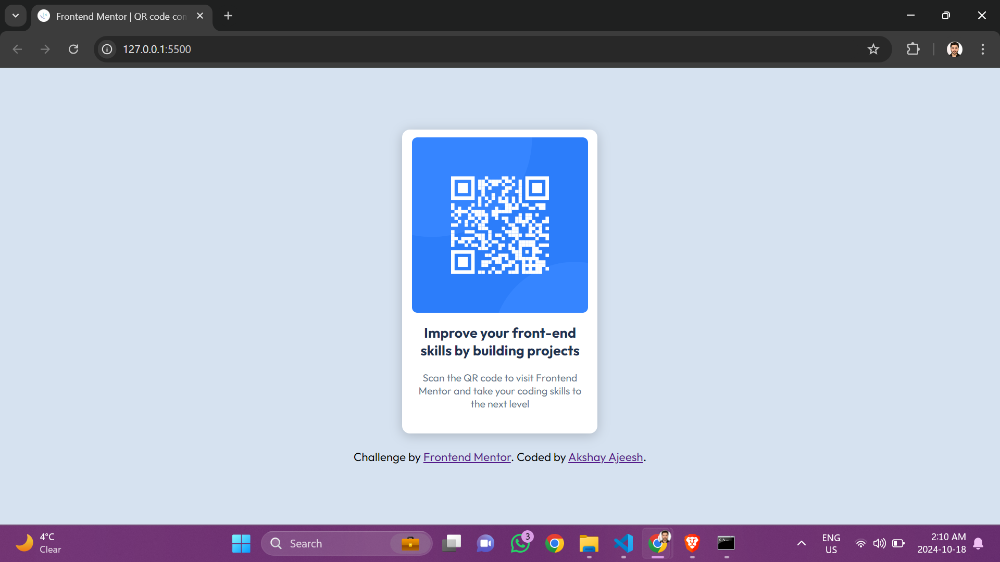
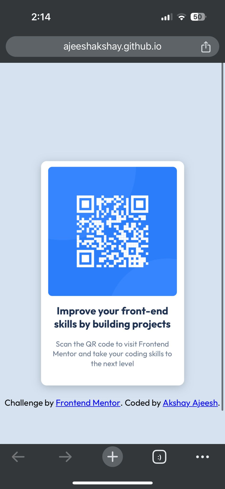

# Frontend Mentor - QR code component solution

This is a solution to the [QR code component challenge on Frontend Mentor](https://www.frontendmentor.io/challenges/qr-code-component-iux_sIO_H). Frontend Mentor challenges help you improve your coding skills by building realistic projects. 

## Table of contents

- [Overview](#overview)
  - [Screenshot](#screenshot)
  - [Links](#links)
- [My process](#my-process)
  - [Built with](#built-with)
  - [What I learned](#what-i-learned)\
- [Author](#author)
- [Acknowledgments](#acknowledgments)

## Overview

### Screenshot

The above is the screenshot of desktop version

The above is the screenshot of mobile(iphone 14 pro) version

### Links

- Live Site URL: [https://ajeeshakshay.github.io/qrcode/]

## My process

### Built with

- Semantic HTML5 markup
- CSS custom properties
- Flexbox
- CSS Grid
- Media queries

### What I learned

I tried to make the mobile version. Since the height was fixed at 100vh, it was not as responsive as needed in mobile version. I tried the shortcut method but was not very successful

## Author

- Github - [Akshay Ajeesh](https://github.com/ajeeshakshay)
- Frontend Mentor - [@ajeeshakshay](https://www.frontendmentor.io/profile/ajeeshakshay)

## Acknowledgments

[Akshay Rajeev Nambiar](https://github.com/akshayrajeevnambiar)

